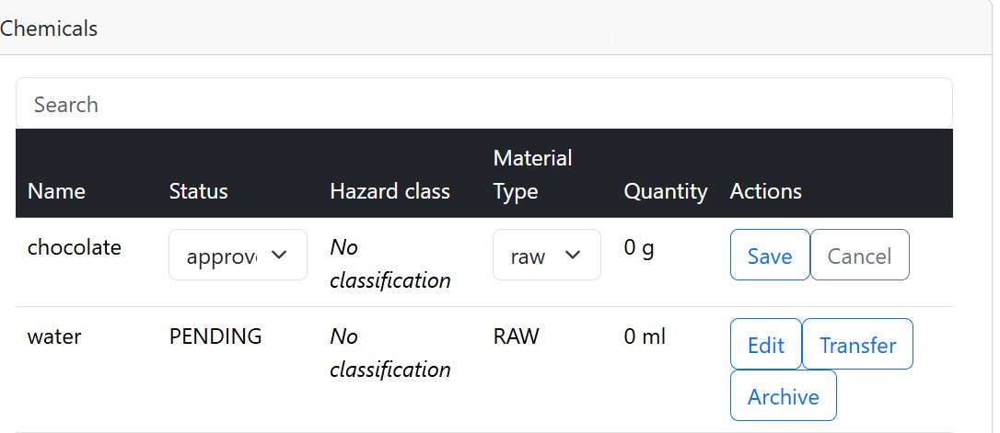

# Inventory Management System

This is a web-based Inventory Management System built with modern web technologies. The project is intended to provide a simple interface to manage chemicals and other inventory items, with full database interaction and type-safe validation.




## Features (so far)
- Dashboard with cards for record counts and listing
- Chemical page, which allows creation and inline editing of certain chemical features
- Type validation using Zod
- Database management and queries via Prisma
- Generic table component
- Debounce hook
- Cards for creating and archiving (a distinct location and material)
- A REACTful form for creating stock movements (be that goods receipt, returns, production use or goods issue)
- Automatic synonym retrieval upon material creation for enhanced searching

## Stack
Next.js & React – frontend framework and UI components
Typescript - for static type checking
Prisma – database ORM with Typescript support
Zod – runtime type validation and schema enforcement
SQLite – supported database (adjust in Prisma config)
React Hot Toast - for some status notifications, with promise capabilities
Bootstrap 5 - for styling and the odd component such as tooltips (in the future react-bootstrap may be worth exploring)
Bootstrap icons - for scalable consistent icons

# Getting Started

## Prerequisites
- Node.js (v22 used)
- npm
- SQLite
## Installation
```
git clone https://github.com/thomasstokes33/inventory-management.git
cd inventory-management
npm ci
```
Then create the `.env` file at the root level and add your database URL:
```
DATABASE_URL="<url>"
```
Apply Prisma migrations:
```
npx prisma migrate dev --name init
```
(Note: you can access the DB with prisma, using `npx prisma studio`).
Finally, run the server with `npm run dev`.
